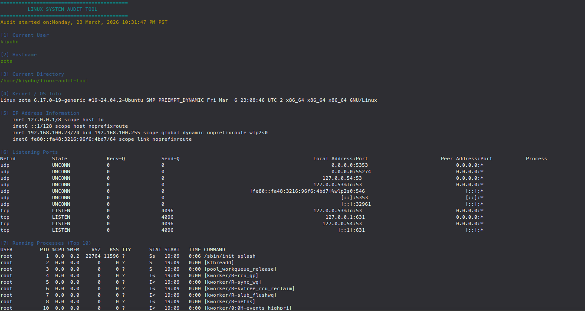
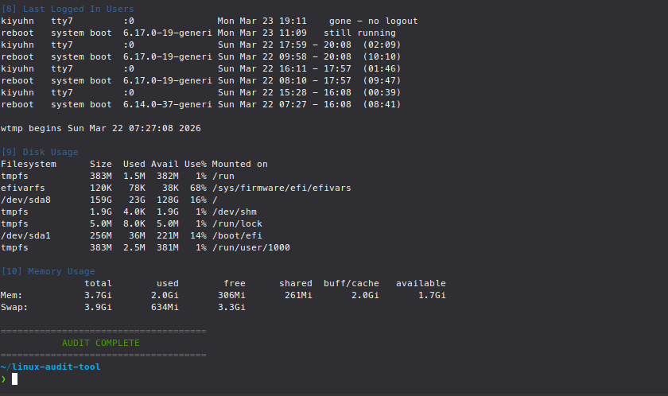

# Linux Audit Tool

A Bash-based Linux system audit tool that gathers useful host and security-related information in a clean terminal report.

## Features

- Displays current user
- Shows hostname and current directory
- Shows kernel / OS information
- Displays IP address information
- Lists listening ports
- Displays running processes
- Shows recent login history
- Reports disk usage
- Reports memory usage

## Technologies Used

- Bash
- Linux command-line tools:
  - whoami
  - hostname
  - pwd
  - uname
  - ip
  - grep
  - ss
  - ps
  - last
  - df
  - free

## 🔧 Usage

```bash
chmod +x audit.sh
./audit.sh
```

## Project Purpose

This project was built to practice:

- Linux command-line Usage  
- Bash Scripting  
- Basic System Auditing  
- Beginner Cybersecurity Concepts  

---

## Sample Use Case

This tool can be used to quickly inspect a Linux machine and review:

- Host Identity  
- Network Exposure  
- Running Processes  
- Memory and Disk Usage  
- Recent Login Activity  

---

## Screenshots

Example output:





---

## Future Improvements

- Export audit results to a report file  
- Add warnings for suspicious ports  
- Add privilege checks  
- Add quick/full audit modes  
- Improve formatting further  

---

## ⚠️ Disclaimer

This tool is intended for educational and authorized use only.
Do not use it on systems you do not own or have permission to test.

---

## Skills Demonstrated

- Linux command-line usage  
- Bash scripting  
- Process and system monitoring  
- Basic cybersecurity awareness  

---

## Author

Kian Bahia  
🔗 [GitHub Profile](https://github.com/k14nx0)

---

## License

This project is for educational purposes. 
